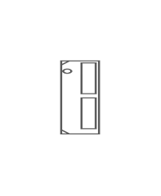

# PowerEdge M620

## Definition

```js
{
  _style: {
    entity: 'strokeColor=#666666;html=1;labelPosition=right;align=left;spacingLeft=15;shadow=0;dashed=0;outlineConnect=0;shape=mxgraph.rack.dell.poweredge_m620;',
  },
  _width: 20,
  _height: 37,
}
```

## Usage

```js
import { PoweredgeM620 } from '@dinghy/standard-components-diagrams/rackDell'

<PoweredgeM620/>
```

## Preview


