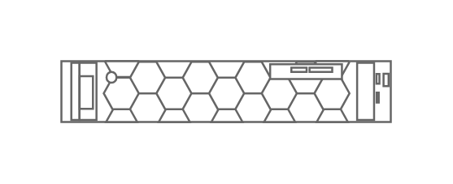

# PowerEdge R7425

## Definition

```js
{
  _style: {
    entity: 'strokeColor=#666666;html=1;labelPosition=right;align=left;spacingLeft=15;shadow=0;dashed=0;outlineConnect=0;shape=mxgraph.rack.dell.poweredge_r7425;',
  },
  _width: 162,
  _height: 30,
}
```

## Usage

```js
import { PoweredgeR7425 } from '@dinghy/standard-components-diagrams/rackDell'

<PoweredgeR7425/>
```

## Preview


