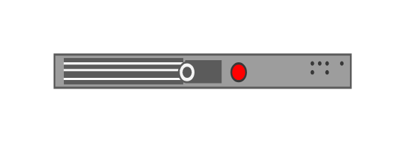

# ARX 500

## Definition

```js
{
  _style: {
    entity: 'strokeColor=#666666;html=1;labelPosition=right;align=left;spacingLeft=15;shadow=0;dashed=0;outlineConnect=0;shape=mxgraph.rack.f5.arx_500;',
  },
  _width: 168,
  _height: 20,
}
```

## Usage

```js
import { Arx500 } from '@dinghy/standard-components-diagrams/rackF5'

<Arx500/>
```

## Preview


