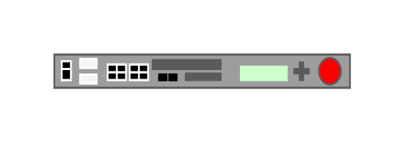

# BIG-IP 3900

## Definition

```js
{
  _style: {
    entity: 'strokeColor=#666666;html=1;labelPosition=right;align=left;spacingLeft=15;shadow=0;dashed=0;outlineConnect=0;shape=mxgraph.rack.f5.big_ip_3900;',
  },
  _width: 168,
  _height: 20,
}
```

## Usage

```js
import { BigIp3900 } from '@dinghy/standard-components-diagrams/rackF5'

<BigIp3900/>
```

## Preview


