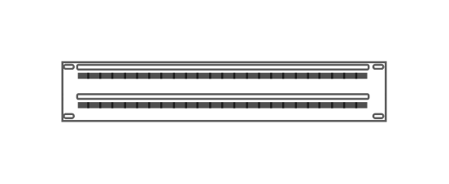

# CAT5e Enhanced Patch Panel 48 ports

## Definition

```js
{
  _style: {
    entity: 'strokeColor=#666666;html=1;labelPosition=right;align=left;spacingLeft=15;shadow=0;dashed=0;outlineConnect=0;shape=mxgraph.rack.general.cat5e_enhanced_patch_panel_48_ports;',
  },
  _width: 160,
  _height: 30,
}
```

## Usage

```js
import { Cat5eEnhancedPatchPanel48Ports } from '@dinghy/standard-components-diagrams/rackGeneral'

<Cat5eEnhancedPatchPanel48Ports/>
```

## Preview


