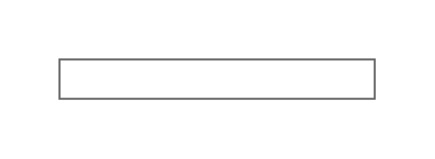

# Horizontal Routing Bank

## Definition

```js
{
  _style: {
    entity: 'strokeColor=#666666;html=1;labelPosition=right;align=left;spacingLeft=15;shadow=0;dashed=0;outlineConnect=0;shape=mxgraph.rackGeneral.horRoutingBank;',
  },
  _width: 160,
  _height: 20,
}
```

## Usage

```js
import { HorizontalRoutingBank } from '@dinghy/standard-components-diagrams/rackGeneral'

<HorizontalRoutingBank/>
```

## Preview


