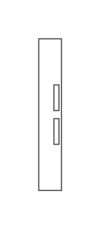

# HP ProLiant BL620c Server Blade

## Definition

```js
{
  _style: {
    entity: 'shape=mxgraph.rack.hp.hp_proliant_bl620c_server_blade;html=1;labelPosition=right;align=left;spacingLeft=15;dashed=0;shadow=0;fillColor=#ffffff;',
  },
  _width: 19,
  _height: 121,
}
```

## Usage

```js
import { HpProliantBl620cServerBlade } from '@dinghy/standard-components-diagrams/rackHpeArubaSwitches'

<HpProliantBl620cServerBlade/>
```

## Preview


