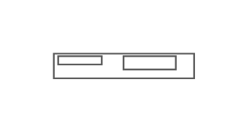

# HP ProLiant SL230s G8

## Definition

```js
{
  _style: {
    entity: 'shape=mxgraph.rack.hp.hp_proliant_sl230s_g8;html=1;labelPosition=right;align=left;spacingLeft=15;dashed=0;shadow=0;fillColor=#ffffff;',
  },
  _width: 81,
  _height: 15,
}
```

## Usage

```js
import { HpProliantSl230sG8 } from '@dinghy/standard-components-diagrams/rackHpeArubaSwitches'

<HpProliantSl230sG8/>
```

## Preview


