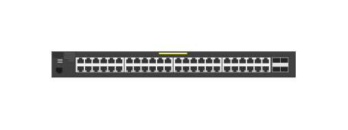

# J9772A 2530-48G PoE+ Switch

## Definition

```js
{
  _style: {
    entity: 'html=1;verticalLabelPosition=bottom;verticalAlign=top;outlineConnect=0;shadow=0;dashed=0;shape=mxgraph.rack.hpe_aruba.switches.j9772a_2530_48g_poeplus_switch;',
  },
  _width: 142,
  _height: 15,
}
```

## Usage

```js
import { J9772a253048gPoeSwitch } from '@dinghy/standard-components-diagrams/rackHpeArubaSwitches'

<J9772a253048gPoeSwitch/>
```

## Preview


