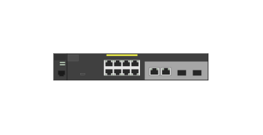

# J9774A 2530-8G PoE+ (front)

## Definition

```js
{
  _style: {
    entity: 'html=1;verticalLabelPosition=bottom;verticalAlign=top;outlineConnect=0;shadow=0;dashed=0;shape=mxgraph.rack.hpe_aruba.switches.j9774a_2530_8g_poeplus_front;',
  },
  _width: 87,
  _height: 15,
}
```

## Usage

```js
import { J9774a25308gPoeFront } from '@dinghy/standard-components-diagrams/rackHpeArubaSwitches'

<J9774a25308gPoeFront/>
```

## Preview


