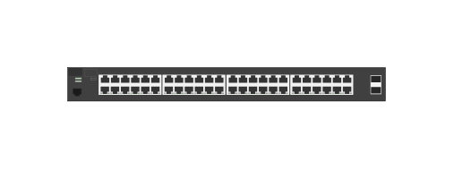

# J9855A 2530-48G 2SFP+ Switch

## Definition

```js
{
  _style: {
    entity: 'html=1;verticalLabelPosition=bottom;verticalAlign=top;outlineConnect=0;shadow=0;dashed=0;shape=mxgraph.rack.hpe_aruba.switches.j9855a_2530_48g_2sfpplus_switch;',
  },
  _width: 142,
  _height: 15,
}
```

## Usage

```js
import { J9855a253048g2sfpSwitch } from '@dinghy/standard-components-diagrams/rackHpeArubaSwitches'

<J9855a253048g2sfpSwitch/>
```

## Preview


