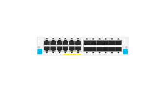

# J9989A 12-port 10/100/1000BASE-T PoE+ and 12-port 1GbE SFP with MACsec v3 zl2 Module

## Definition

```js
{
  _style: {
    entity: 'html=1;verticalLabelPosition=bottom;verticalAlign=top;outlineConnect=0;shadow=0;dashed=0;shape=mxgraph.rack.hpe_aruba.switches.j9989a_12_port_10_100_1000base_t_poeplus_and_12_port_1gbe_sfp_with_macsec_v3_zl2_module;',
  },
  _width: 75,
  _height: 15,
}
```

## Usage

```js
import { J9989a12Port101001000baseTPoeAnd12Port1gbeSfpWithMacsecV3Zl2Module } from '@dinghy/standard-components-diagrams/rackHpeArubaSwitches'

<J9989a12Port101001000baseTPoeAnd12Port1gbeSfpWithMacsecV3Zl2Module/>
```

## Preview


