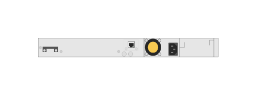

# JL073A HPE Aruba 3810M 24-port GT PoE 1-slot Switch (rear)

## Definition

```js
{
  _style: {
    entity: 'html=1;verticalLabelPosition=bottom;verticalAlign=top;outlineConnect=0;shadow=0;dashed=0;shape=mxgraph.rack.hpe_aruba.switches.jl073a_hpe_aruba_3810m_24_port_gt_poeplus_1_slot_switch_rear;',
  },
  _width: 142,
  _height: 15,
}
```

## Usage

```js
import { Jl073aHpeAruba3810m24PortGtPoe1SlotSwitchRear } from '@dinghy/standard-components-diagrams/rackHpeArubaSwitches'

<Jl073aHpeAruba3810m24PortGtPoe1SlotSwitchRear/>
```

## Preview


