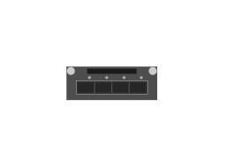

# JL083A 3810M 2930M 4-port 10GbE SFP+ Module

## Definition

```js
{
  _style: {
    entity: 'html=1;verticalLabelPosition=bottom;verticalAlign=top;outlineConnect=0;shadow=0;dashed=0;shape=mxgraph.rack.hpe_aruba.switches.jl083a_3810m_2930m_4_port_10gbe_sfpplus_module;',
  },
  _width: 41,
  _height: 15,
}
```

## Usage

```js
import { Jl083a3810m2930m4Port10gbeSfpModule } from '@dinghy/standard-components-diagrams/rackHpeArubaSwitches'

<Jl083a3810m2930m4Port10gbeSfpModule/>
```

## Preview


