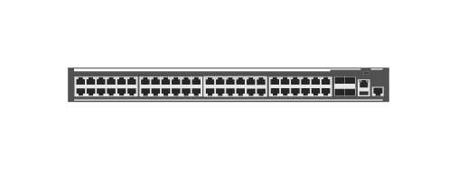

# JL321A Aruba 2930M-48G 1-slot Switch

## Definition

```js
{
  _style: {
    entity: 'html=1;verticalLabelPosition=bottom;verticalAlign=top;outlineConnect=0;shadow=0;dashed=0;shape=mxgraph.rack.hpe_aruba.switches.jl321a_aruba_2930m_48g_1_slot_switch;',
  },
  _width: 142,
  _height: 15,
}
```

## Usage

```js
import { Jl321aAruba2930m48g1SlotSwitch } from '@dinghy/standard-components-diagrams/rackHpeArubaSwitches'

<Jl321aAruba2930m48g1SlotSwitch/>
```

## Preview


