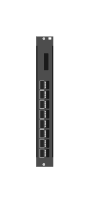

# JL365A-8P QSFP+ Adv

## Definition

```js
{
  _style: {
    entity: 'html=1;verticalLabelPosition=bottom;verticalAlign=top;outlineConnect=0;shadow=0;dashed=0;shape=mxgraph.rack.hpe_aruba.switches.jl365a_8p_qsfpplus_adv;',
  },
  _width: 14,
  _height: 107,
}
```

## Usage

```js
import { Jl365a8pQsfpAdv } from '@dinghy/standard-components-diagrams/rackHpeArubaSwitches'

<Jl365a8pQsfpAdv/>
```

## Preview


