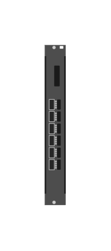

# JL366A-6P QSFP28 Adv

## Definition

```js
{
  _style: {
    entity: 'html=1;verticalLabelPosition=bottom;verticalAlign=top;outlineConnect=0;shadow=0;dashed=0;shape=mxgraph.rack.hpe_aruba.switches.jl366a_6p_qsfp28_adv;',
  },
  _width: 14,
  _height: 107,
}
```

## Usage

```js
import { Jl366a6pQsfp28Adv } from '@dinghy/standard-components-diagrams/rackHpeArubaSwitches'

<Jl366a6pQsfp28Adv/>
```

## Preview


