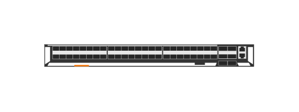

# JL479A Aruba 8320-48p 10G SFP SFP+ and 6p 40G QSFP+ 5 fan 2 PS Switch Bundle

## Definition

```js
{
  _style: {
    entity: 'html=1;verticalLabelPosition=bottom;verticalAlign=top;outlineConnect=0;shadow=0;dashed=0;shape=mxgraph.rack.hpe_aruba.switches.jl479a_aruba_8320_48p_10g_sfp_sfpplus_and_6p_40g_qsfpplus_5_fan_2_ps_switch_bundle;',
  },
  _width: 142,
  _height: 15,
}
```

## Usage

```js
import { Jl479aAruba832048p10gSfpSfpAnd6p40gQsfp5Fan2PsSwitchBundle } from '@dinghy/standard-components-diagrams/rackHpeArubaSwitches'

<Jl479aAruba832048p10gSfpSfpAnd6p40gQsfp5Fan2PsSwitchBundle/>
```

## Preview


