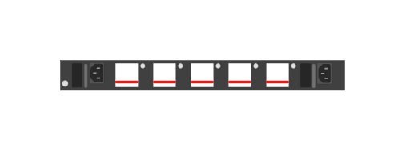

# JL581A Aruba 8320-48p-1G 10GBASE-T and 6p 40G QSFP+ 5 fans 2 PS Switch Bundle (rear)

## Definition

```js
{
  _style: {
    entity: 'html=1;verticalLabelPosition=bottom;verticalAlign=top;outlineConnect=0;shadow=0;dashed=0;shape=mxgraph.rack.hpe_aruba.switches.jl581a_aruba_8320_48p_1g_10gbase_t_and_6p_40g_qsfpplus_5_fans_2_ps_switch_bundle_rear;',
  },
  _width: 142,
  _height: 15,
}
```

## Usage

```js
import { Jl581aAruba832048p1g10gbaseTAnd6p40gQsfp5Fans2PsSwitchBundleRear } from '@dinghy/standard-components-diagrams/rackHpeArubaSwitches'

<Jl581aAruba832048p1g10gbaseTAnd6p40gQsfp5Fans2PsSwitchBundleRear/>
```

## Preview


