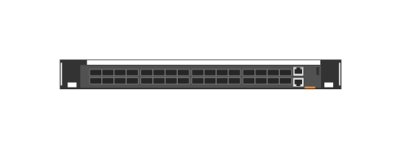

# JL627A Aruba 8325 32C B2F (front)

## Definition

```js
{
  _style: {
    entity: 'html=1;verticalLabelPosition=bottom;verticalAlign=top;outlineConnect=0;shadow=0;dashed=0;shape=mxgraph.rack.hpe_aruba.switches.jl627a_aruba_8325_32c_b2f_front;',
  },
  _width: 142,
  _height: 15,
}
```

## Usage

```js
import { Jl627aAruba832532cB2fFront } from '@dinghy/standard-components-diagrams/rackHpeArubaSwitches'

<Jl627aAruba832532cB2fFront/>
```

## Preview


