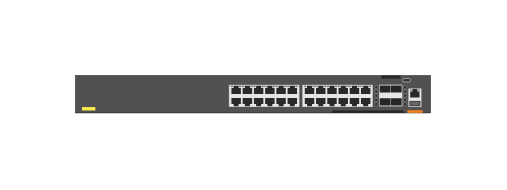

# JL666A Aruba 6300F 24-port 1GbE Class 4 PoE and 4-port SFP56 Switch

## Definition

```js
{
  _style: {
    entity: 'html=1;verticalLabelPosition=bottom;verticalAlign=top;outlineConnect=0;shadow=0;dashed=0;shape=mxgraph.rack.hpe_aruba.switches.jl666a_aruba_6300f_24_port_1gbe_class_4_poe_and_4_port_sfp56_switch;',
  },
  _width: 142,
  _height: 15,
}
```

## Usage

```js
import { Jl666aAruba6300f24Port1gbeClass4PoeAnd4PortSfp56Switch } from '@dinghy/standard-components-diagrams/rackHpeArubaSwitches'

<Jl666aAruba6300f24Port1gbeClass4PoeAnd4PortSfp56Switch/>
```

## Preview


