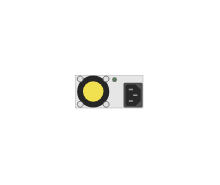

# JL670A Aruba 6300M PSU Module

## Definition

```js
{
  _style: {
    entity: 'html=1;verticalLabelPosition=bottom;verticalAlign=top;outlineConnect=0;shadow=0;dashed=0;shape=mxgraph.rack.hpe_aruba.switches.jl670a_aruba_6300m_psu_module;',
  },
  _width: 27,
  _height: 13,
}
```

## Usage

```js
import { Jl670aAruba6300mPsuModule } from '@dinghy/standard-components-diagrams/rackHpeArubaSwitches'

<Jl670aAruba6300mPsuModule/>
```

## Preview


