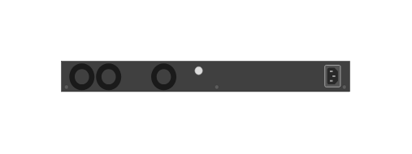

# JL726A Aruba 6200F 48-port 1GbE and 4-port SFP+ Switch (rear)

## Definition

```js
{
  _style: {
    entity: 'html=1;verticalLabelPosition=bottom;verticalAlign=top;outlineConnect=0;shadow=0;dashed=0;shape=mxgraph.rack.hpe_aruba.switches.jl726a_aruba_6200f_48_port_1gbe_and_4_port_sfpplus_switch_rear;',
  },
  _width: 142,
  _height: 15,
}
```

## Usage

```js
import { Jl726aAruba6200f48Port1gbeAnd4PortSfpSwitchRear } from '@dinghy/standard-components-diagrams/rackHpeArubaSwitches'

<Jl726aAruba6200f48Port1gbeAnd4PortSfpSwitchRear/>
```

## Preview


