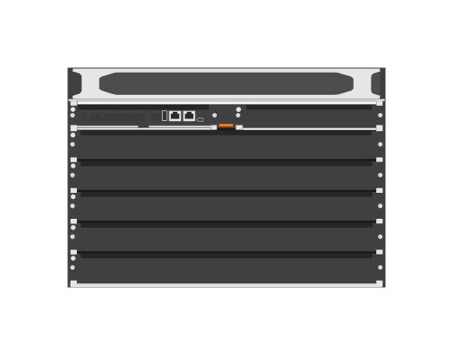

# R0X26A Aruba CX 6400 Switch

## Definition

```js
{
  _style: {
    entity: 'html=1;verticalLabelPosition=bottom;verticalAlign=top;outlineConnect=0;shadow=0;dashed=0;shape=mxgraph.rack.hpe_aruba.switches.r0x26a_aruba_cx_6400_switch;',
  },
  _width: 142,
  _height: 98,
}
```

## Usage

```js
import { R0x26aArubaCx6400Switch } from '@dinghy/standard-components-diagrams/rackHpeArubaSwitches'

<R0x26aArubaCx6400Switch/>
```

## Preview


