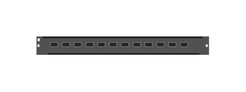

# R0X45A Aruba 6400-12p 40G/100G QSFP28 Module

## Definition

```js
{
  _style: {
    entity: 'html=1;verticalLabelPosition=bottom;verticalAlign=top;outlineConnect=0;shadow=0;dashed=0;shape=mxgraph.rack.hpe_aruba.switches.r0x45a_aruba_6400_12p_40g_100g_qsfp28_module;',
  },
  _width: 142,
  _height: 15,
}
```

## Usage

```js
import { R0x45aAruba640012p40g100gQsfp28Module } from '@dinghy/standard-components-diagrams/rackHpeArubaSwitches'

<R0x45aAruba640012p40g100gQsfp28Module/>
```

## Preview


