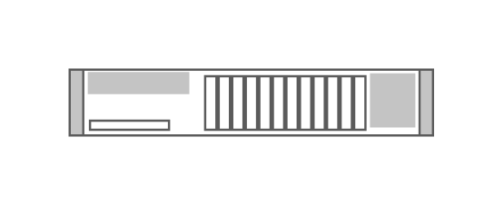

# IBM x3750

## Definition

```js
{
  _style: {
    entity: 'shape=mxgraph.rack.ibm.ibm_x3750;html=1;labelPosition=right;align=left;spacingLeft=15;dashed=0;shadow=0;fillColor=#ffffff;',
  },
  _width: 161,
  _height: 30,
}
```

## Usage

```js
import { IbmX3750 } from '@dinghy/standard-components-diagrams/rackIbm'

<IbmX3750/>
```

## Preview


