# Rack Oracle Entities

- [NetraBladeX32bServer](./netra-blade-x3-2b-server.md)  
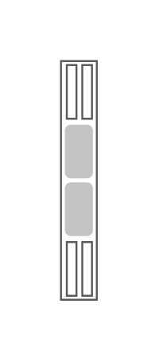

- [NetraCp3260AtcaBladeServer](./netra-cp3260-atca-blade-server.md)  
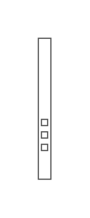

- [NetraCp3270AtcaBladeServer](./netra-cp3270-atca-blade-server.md)  
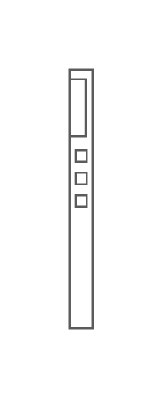

- [NetraCt900AtcaBladeServer](./netra-ct900-atca-blade-server.md)  

- [NetraCt9000Server](./netra-ct9000-server.md)  
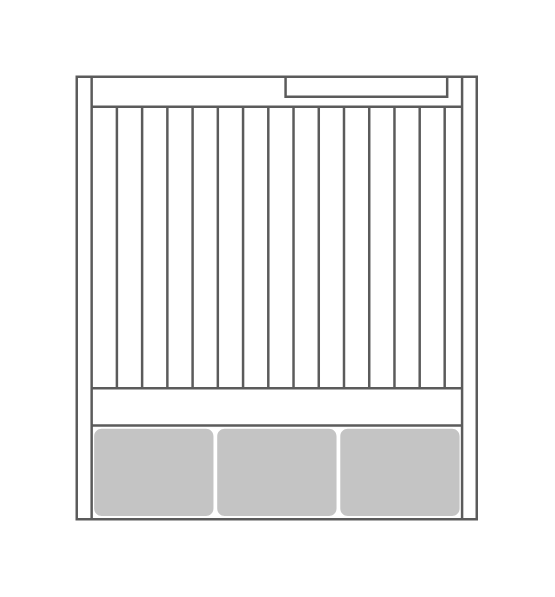

- [NetraServerX32](./netra-server-x3-2.md)  
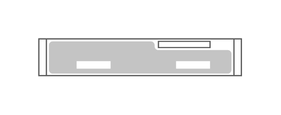

- [NetraSparcT41Server](./netra-sparc-t4-1-server.md)  
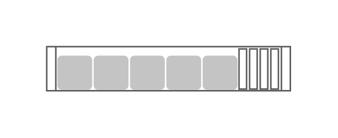

- [NetraSparcT41bServerModule](./netra-sparc-t4-1b-server-module.md)  
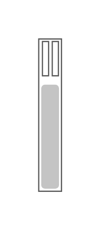

- [NetraSparcT42Server](./netra-sparc-t4-2-server.md)  
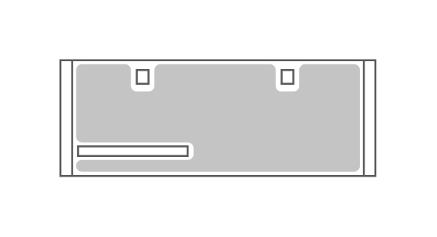

- [NetraX4270Server](./netra-x4270-server.md)  

- [NetraX6270ServerModule](./netra-x6270-server-module.md)  
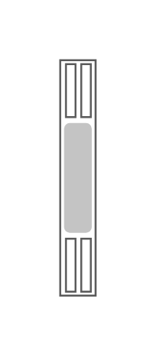

- [SparcEnterpriseM4000Server](./sparc-enterprise-m4000-server.md)  
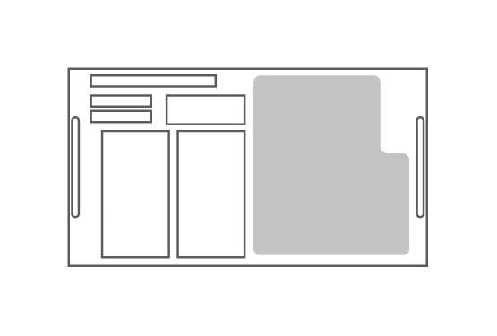

- [SparcEnterpriseM5000Server](./sparc-enterprise-m5000-server.md)  
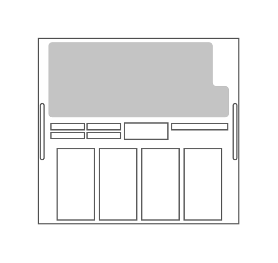

- [SparcT41Server](./sparc-t4-1-server.md)  
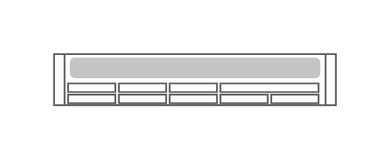

- [SparcT41bServerModule](./sparc-t4-1b-server-module.md)  

- [SparcT42Server](./sparc-t4-2-server.md)  
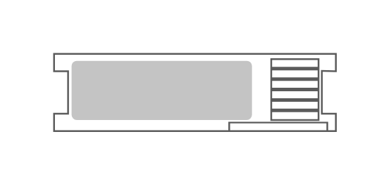

- [SparcT44Server](./sparc-t4-4-server.md)  
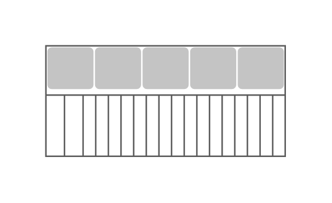

- [SunBlade6000Enclosure](./sun-blade-6000-enclosure.md)  
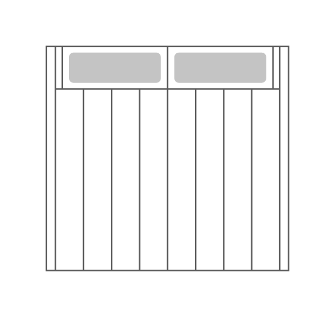

- [SunBlade6000EthernetNetworkExpressModule24p10Gbe](./sun-blade-6000-ethernet-network-express-module-24p-10-gbe.md)  
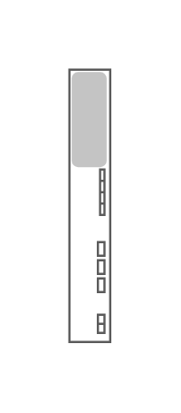

- [SunBlade6000Virtualized40GbeNetworkExpressModule](./sun-blade-6000-virtualized-40-gbe-network-express-module.md)  
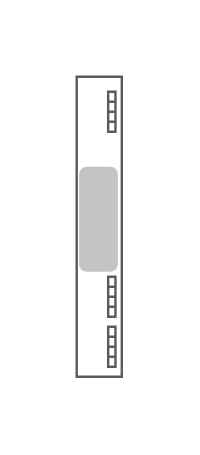

- [SunBladeX32bServer](./sun-blade-x3-2b-server.md)  

- [SunBladeX6270M2ServerModule](./sun-blade-x6270-m2-server-module.md)  

- [SunDatacenterInfinibandSwitch36](./sun-datacenter-infiniband-switch-36.md)  
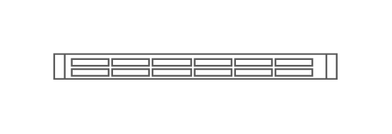

- [SunNetwork10gbeSwitch72p](./sun-network-10gbe-switch-72p.md)  
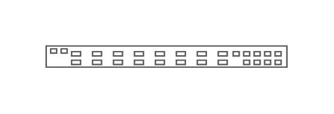

- [SunNetworkQdrInfinibandGatewaySwitch](./sun-network-qdr-infiniband-gateway-switch.md)  
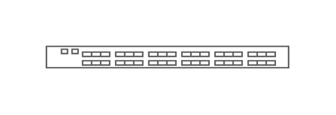

- [SunServerX24](./sun-server-x2-4.md)  

- [SunServerX28](./sun-server-x2-8.md)  
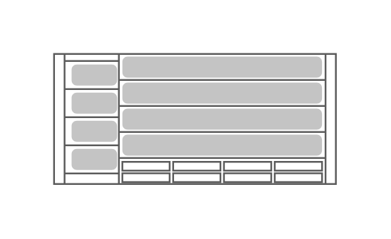

- [SunServerX32](./sun-server-x3-2.md)  
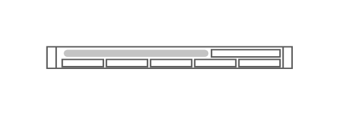

- [SunServerX32l](./sun-server-x3-2l.md)  
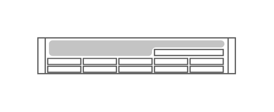

- [SunStorage2500M2Array](./sun-storage-2500-m2-array.md)  

- [SunZfsStorage7120](./sun-zfs-storage-7120.md)  
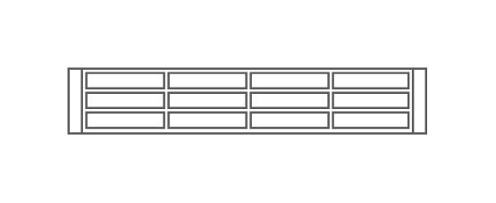

- [SunZfsStorage7320](./sun-zfs-storage-7320.md)  
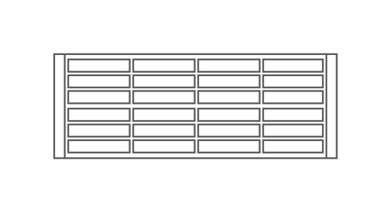

- [SunfireT1000](./sunfire-t1000.md)  
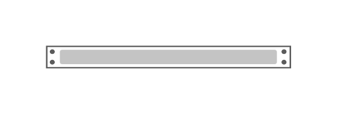

- [SunfireX2100](./sunfire-x2100.md)  

- [SunfireX4100](./sunfire-x4100.md)  
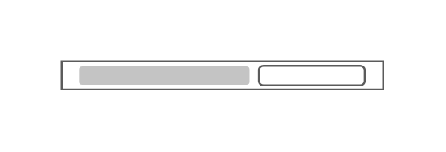

- [SunfireX4500](./sunfire-x4500.md)  

- [SunfireX4600](./sunfire-x4600.md)  
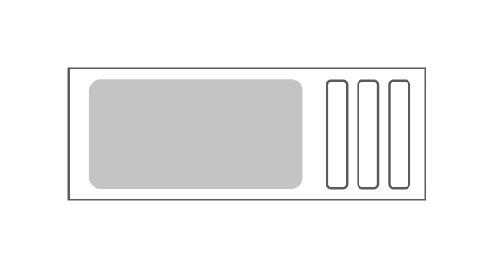
