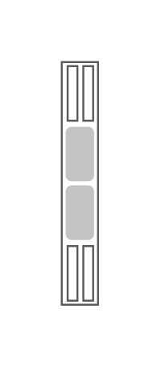

# Sun Blade X3-2B Server

## Definition

```js
{
  _style: {
    entity: 'shape=mxgraph.rack.oracle.sun_blade_x3-2b_server;html=1;labelPosition=right;align=left;spacingLeft=15;dashed=0;shadow=0;fillColor=#ffffff;',
  },
  _width: 19,
  _height: 121,
}
```

## Usage

```js
import { SunBladeX32bServer } from '@dinghy/standard-components-diagrams/rackOracle'

<SunBladeX32bServer/>
```

## Preview


