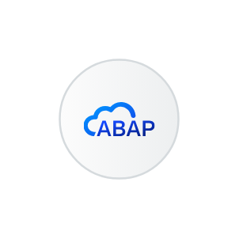
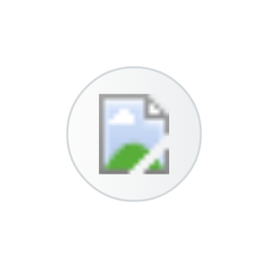

# Sap App Dev Automation Entities

- [ApplicationFrontendService](./application-frontend-service.md)  

- [BusinessApplicationStudio](./business-application-studio.md)  

- [ExtensibilityServicesForSapBtp](./extensibility-services-for-sap-btp.md)  

- [Html5AppRepository](./html5-app-repository.md)  

- [SapBtpAbapEnvironment](./sap-btp-abap-environment.md)  

- [SapBuild](./sap-build.md)  

- [SapBuildApps](./sap-build-apps.md)  

- [SapBuildCode](./sap-build-code.md)  

- [SapBuildProcessAutomation](./sap-build-process-automation.md)  

- [SapBuildWorkZoneAdvancedEdition](./sap-build-work-zone-advanced-edition.md)  

- [SapBuildWorkZoneStandardEdition](./sap-build-work-zone-standard-edition.md)  

- [SapCloudApplicationProgrammingModel](./sap-cloud-application-programming-model.md)  

- [SapMobileServices](./sap-mobile-services.md)  

- [SapTaskCenter](./sap-task-center.md)  

- [UiThemeDesigner](./ui-theme-designer.md)  

- [Ui5FlexibilityForKeyUsers](./ui5-flexibility-for-key-users.md)  

