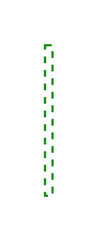

# 3rd Party IdP and Protocols 4

## Definition

```js
{
  _style: {
    entity: 'endArrow=none;html=1;strokeColor=#188918;bendable=1;rounded=0;endFill=0;endSize=3;strokeWidth=1.5;dashed=1;sourcePerimeterSpacing=0;targetPerimeterSpacing=10;',
  },
  _width: 5,
  _height: 100,
}
```

## Usage

```js
import { Component3rdPartyIdpAndProtocols4 } from '@dinghy/standard-components-diagrams/sapEssentials'

<Component3rdPartyIdpAndProtocols4/>
```

## Preview


