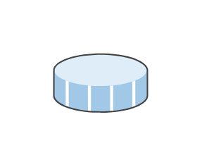

# Datastore Snapshot

## Definition

```js
{
  _style: {
    entity: 'shadow=0;dashed=0;html=1;labelPosition=center;verticalLabelPosition=bottom;verticalAlign=top;align=center;outlineConnect=0;shape=mxgraph.veeam.3d.datastore_snapshot;',
  },
  _width: 54,
  _height: 34,
}
```

## Usage

```js
import { DatastoreSnapshot } from '@dinghy/standard-components-diagrams/veeam3d'

<DatastoreSnapshot/>
```

## Preview


