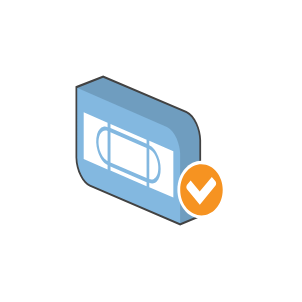

# Tape Checked

## Definition

```js
{
  _style: {
    entity: 'shadow=0;dashed=0;html=1;labelPosition=center;verticalLabelPosition=bottom;verticalAlign=top;align=center;outlineConnect=0;shape=mxgraph.veeam.3d.tape_checked;',
  },
  _original_width: 70,
  _original_height: 58,

}
```

## Usage

```js
import { TapeChecked } from '@dinghy/standard-components-diagrams/veeam3d'

<TapeChecked/>
```

## Preview


