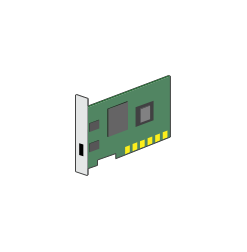

# Network Card

## Definition

```js
{
  _style: {
    entity: 'sketch=0;shadow=0;dashed=0;html=1;labelPosition=center;verticalLabelPosition=bottom;verticalAlign=top;align=center;outlineConnect=0;shape=mxgraph.veeam.3d.network_card;',
  },
  _width: 38,
  _height: 40,
}
```

## Usage

```js
import { NetworkCard } from '@dinghy/standard-components-diagrams/veeam23d'

<NetworkCard/>
```

## Preview


