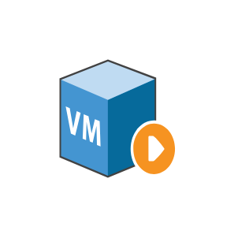

# VM Running

## Definition

```js
{
  _style: {
    entity: 'sketch=0;shadow=0;dashed=0;html=1;labelPosition=center;verticalLabelPosition=bottom;verticalAlign=top;align=center;outlineConnect=0;shape=mxgraph.veeam.3d.vm_running;',
  },
  _original_width: 56,
  _original_height: 46,

}
```

## Usage

```js
import { VmRunning } from '@dinghy/standard-components-diagrams/veeam23d'

<VmRunning/>
```

## Preview


