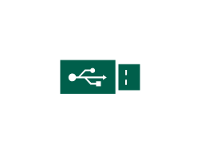

# USB Drive

## Definition

```js
{
  _style: {
    entity: 'sketch=0;pointerEvents=1;shadow=0;dashed=0;html=1;strokeColor=none;fillColor=#005F4B;labelPosition=center;verticalLabelPosition=bottom;verticalAlign=top;align=center;outlineConnect=0;shape=mxgraph.veeam2.usb_drive;',
  },
  _width: 40,
  _height: 17,
}
```

## Usage

```js
import { UsbDrive } from '@dinghy/standard-components-diagrams/veeam2DataCenter'

<UsbDrive/>
```

## Preview


