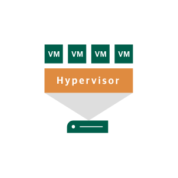

# Virtual Host

## Definition

```js
{
  _style: {
    entity: 'sketch=0;pointerEvents=1;shadow=0;dashed=0;html=1;strokeColor=none;fillColor=#005F4B;labelPosition=center;verticalLabelPosition=bottom;verticalAlign=top;align=center;outlineConnect=0;shape=mxgraph.veeam2.virtual_host;',
  },
  _original_width: 82,
  _original_height: 79,

}
```

## Usage

```js
import { VirtualHost } from '@dinghy/standard-components-diagrams/veeam2DataCenter'

<VirtualHost/>
```

## Preview


