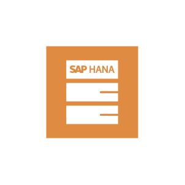

# Veeam2 Software Entities

- [Antivirus](./antivirus.md)  

- [Application](./application.md)  

- [Database](./database.md)  

- [DatabaseServer](./database-server.md)  

- [DomainController](./domain-controller.md)  

- [ExchangeServer](./exchange-server.md)  

- [Firewall](./firewall.md)  

- [Linux](./linux.md)  

- [LinuxServer](./linux-server.md)  

- [MicrosoftActiveDirectory](./microsoft-active-directory.md)  

- [MicrosoftExchange](./microsoft-exchange.md)  

- [MicrosoftOffice](./microsoft-office.md)  

- [MicrosoftOnedrive](./microsoft-onedrive.md)  

- [MicrosoftOutlook](./microsoft-outlook.md)  

- [MicrosoftScom](./microsoft-scom.md)  

- [MicrosoftScvmm](./microsoft-scvmm.md)  

- [MicrosoftSharepoint](./microsoft-sharepoint.md)  

- [MicrosoftSql](./microsoft-sql.md)  

- [MicrosoftSqlDb](./microsoft-sql-db.md)  

- [MicrosoftTeams](./microsoft-teams.md)  

- [MicrosoftWindows](./microsoft-windows.md)  

- [Nutanix](./nutanix.md)  

- [Openvpn](./openvpn.md)  

- [OracleDb](./oracle-db.md)  

- [OracleRman](./oracle-rman.md)  

- [Powershell](./powershell.md)  

- [SapBrtools](./sap-brtools.md)  

- [SapHana](./sap-hana.md)  

- [SapHanaDb](./sap-hana-db.md)  

- [ServerNutanix](./server-nutanix.md)  

- [SharepointServer](./sharepoint-server.md)  

- [SqlServer](./sql-server.md)  

- [VcenterServer](./vcenter-server.md)  

- [VcloudDirectorServer](./vcloud-director-server.md)  

- [VmwareVcloudDirector](./vmware-vcloud-director.md)  

- [VmwareVsphere](./vmware-vsphere.md)  

- [WindowsServer](./windows-server.md)  

- [Wireguard](./wireguard.md)  

