# Veeam2 Storage Entities

- [AwsS3](./aws-s3.md)  

- [AzureBlob](./azure-blob.md)  

- [BackupFile](./backup-file.md)  

- [DataVolume](./data-volume.md)  
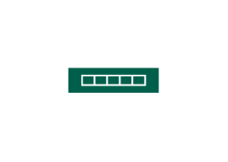

- [DataVolumeSnapshot](./data-volume-snapshot.md)  

- [DataVolumeWithSnapshot](./data-volume-with-snapshot.md)  

- [Datastore](./datastore.md)  

- [Datastore33Full](./datastore-33-full.md)  

- [Datastore66Full](./datastore-66-full.md)  

- [DatastoreEmpty](./datastore-empty.md)  

- [DeduplicatingStorage](./deduplicating-storage.md)  
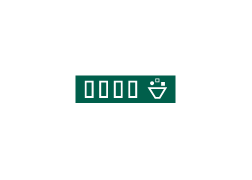

- [File](./file.md)  

- [Folder](./folder.md)  

- [IbmObjectStorage](./ibm-object-storage.md)  
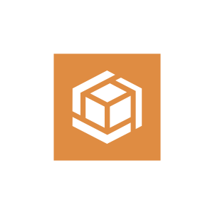

- [Nas](./nas.md)  

- [ObjectStorage](./object-storage.md)  

- [S3Compatible](./s3-compatible.md)  
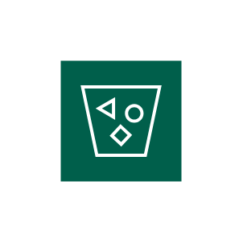

- [SdCard](./sd-card.md)  

- [SharedFolder](./shared-folder.md)  

- [Storage](./storage.md)  
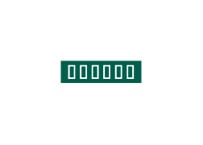

- [StorageSnapshot](./storage-snapshot.md)  
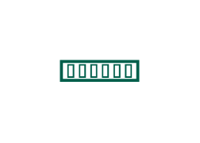

- [StorageStack](./storage-stack.md)  
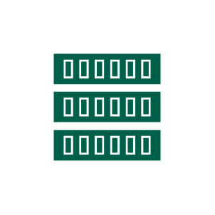

- [StorageWithSnapshot](./storage-with-snapshot.md)  

- [Tape](./tape.md)  

- [TapeCheckout](./tape-checkout.md)  
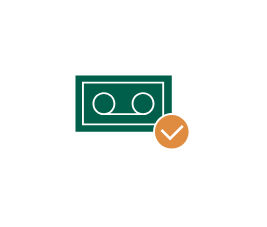

- [TapeEncrypted](./tape-encrypted.md)  

- [TapeLibrary](./tape-library.md)  

- [TapeLocked](./tape-locked.md)  

- [TapeMediaPool](./tape-media-pool.md)  

- [TapeRecording](./tape-recording.md)  

- [TapeWritingDevice](./tape-writing-device.md)  

- [VbrConfigurationBackup](./vbr-configuration-backup.md)  
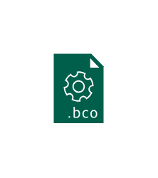

- [VbrTransactionLogBackup](./vbr-transaction-log-backup.md)  

- [VeeamBackupChainMetadata](./veeam-backup-chain-metadata.md)  
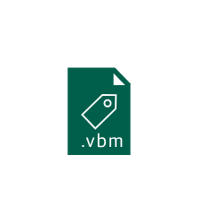

- [VeeamFullBackup](./veeam-full-backup.md)  

- [VeeamIncrementalBackup](./veeam-incremental-backup.md)  
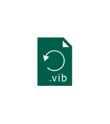

- [VeeamReversedIncrementalBackup](./veeam-reversed-incremental-backup.md)  
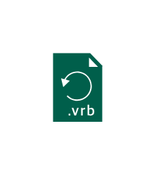

- [VmwareVsan](./vmware-vsan.md)  

