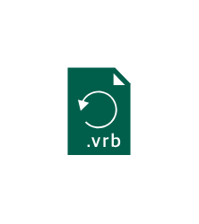

# Veeam Reversed Incremental Backup

## Definition

```js
{
  _style: {
    entity: 'sketch=0;pointerEvents=1;shadow=0;dashed=0;html=1;strokeColor=none;fillColor=#005F4B;labelPosition=center;verticalLabelPosition=bottom;verticalAlign=top;align=center;outlineConnect=0;shape=mxgraph.veeam2.veeam_reversed_incremental_backup;',
  },
  _width: 28.000000000000004,
  _height: 39,
}
```

## Usage

```js
import { VeeamReversedIncrementalBackup } from '@dinghy/standard-components-diagrams/veeam2Storage'

<VeeamReversedIncrementalBackup/>
```

## Preview


