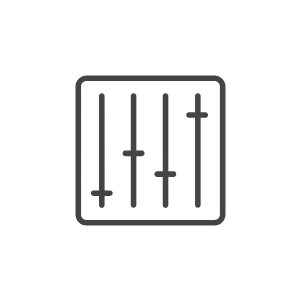

# NSX Manager

## Definition

```js
{
  _style: {
    entity: 'sketch=0;pointerEvents=1;shadow=0;dashed=0;html=1;strokeColor=none;fillColor=#434445;aspect=fixed;labelPosition=center;verticalLabelPosition=bottom;verticalAlign=top;align=center;outlineConnect=0;shape=mxgraph.vvd.nsx_manager;',
  },
  _original_width: 50,
  _original_height: 50,

}
```

## Usage

```js
import { NsxManager } from '@dinghy/standard-components-diagrams/vmwareValidatedDesign'

<NsxManager/>
```

## Preview


