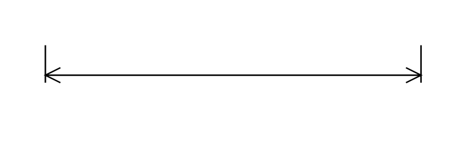

# Dimension 2

## Definition

```js
{
  _style: {
    entity: 'verticalLabelPosition=middle;dashed=0;shadow=0;html=1;shape=mxgraph.cabinets.dimensionBottom;verticalAlign=bottom;align=center;',
  },
  _width: 250,
  _height: 40,
}
```

## Usage

```js
import { Dimension2 } from '@dinghy/standard-components-diagrams/cabinets'

<Dimension2/>
```

## Preview


