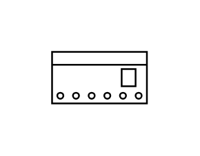

# Overcurrent Relay 125-400A

## Definition

```js
{
  _style: {
    entity: 'verticalLabelPosition=bottom;dashed=0;shadow=0;html=1;align=center;verticalAlign=top;shape=mxgraph.cabinets.overcurrent_relay_125_400a;',
  },
  _width: 55.00000000000001,
  _height: 30,
}
```

## Usage

```js
import { OvercurrentRelay125400a } from '@dinghy/standard-components-diagrams/cabinets'

<OvercurrentRelay125400a/>
```

## Preview


