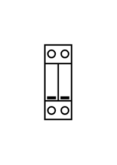

# Surge Protection 2p

## Definition

```js
{
  _style: {
    entity: 'verticalLabelPosition=bottom;dashed=0;shadow=0;html=1;align=center;verticalAlign=top;shape=mxgraph.cabinets.surge_protection_2p;',
  },
  _width: 18,
  _height: 50,
}
```

## Usage

```js
import { SurgeProtection2p } from '@dinghy/standard-components-diagrams/cabinets'

<SurgeProtection2p/>
```

## Preview


