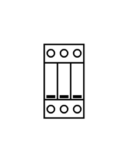

# Surge Protection 3p

## Definition

```js
{
  _style: {
    entity: 'verticalLabelPosition=bottom;dashed=0;shadow=0;html=1;align=center;verticalAlign=top;shape=mxgraph.cabinets.surge_protection_3p;',
  },
  _width: 27,
  _height: 50,
}
```

## Usage

```js
import { SurgeProtection3p } from '@dinghy/standard-components-diagrams/cabinets'

<SurgeProtection3p/>
```

## Preview


