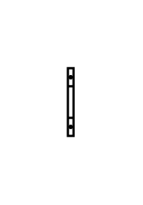

# Terminal 4-6mm2

## Definition

```js
{
  _style: {
    entity: 'verticalLabelPosition=bottom;dashed=0;shadow=0;html=1;align=center;verticalAlign=top;shape=mxgraph.cabinets.terminal_4_6mm2;',
  },
  _width: 2.5,
  _height: 30,
}
```

## Usage

```js
import { Terminal46mm2 } from '@dinghy/standard-components-diagrams/cabinets'

<Terminal46mm2/>
```

## Preview


