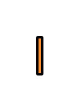

# Correlation Identifier 2

## Definition

```js
{
  _style: {
    entity: 'strokeWidth=2;dashed=0;align=center;fontSize=8;shape=rect;fillColor=#FF9238;strokeColor=#000000;fontStyle=1;fontColor=#ffffff;whiteSpace=wrap;html=1;',
  },
  _width: 4,
  _height: 30,
}
```

## Usage

```js
import { CorrelationIdentifier2 } from '@dinghy/standard-components-diagrams/eipMessageConstruction'

<CorrelationIdentifier2/>
```

## Preview


