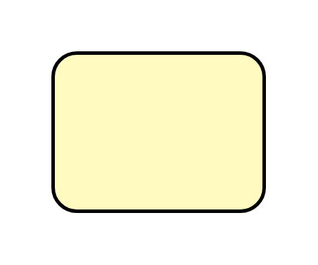

# Message Broker

## Definition

```js
{
  _style: {
    entity: 'strokeWidth=2;dashed=0;align=center;fontSize=8;shape=rect;fillColor=#fffbc0;strokeColor=#000000;',
  },
  _width: 120,
  _height: 90,
}
```

## Usage

```js
import { MessageBroker } from '@dinghy/standard-components-diagrams/eipMessageRouting'

<MessageBroker/>
```

## Preview


