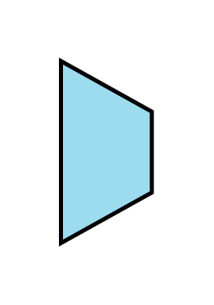
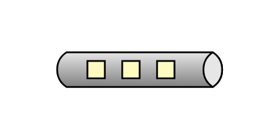
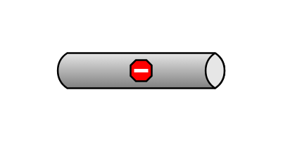
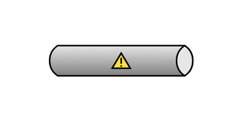
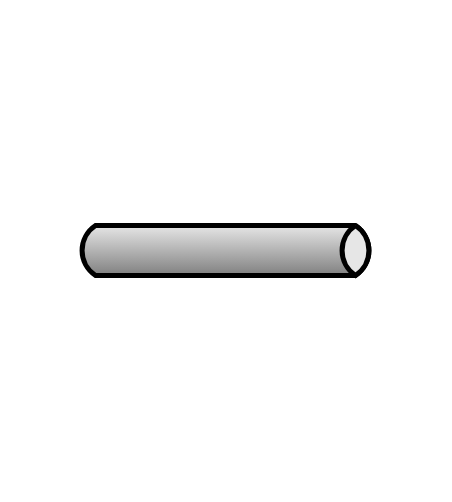
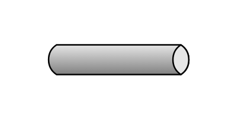
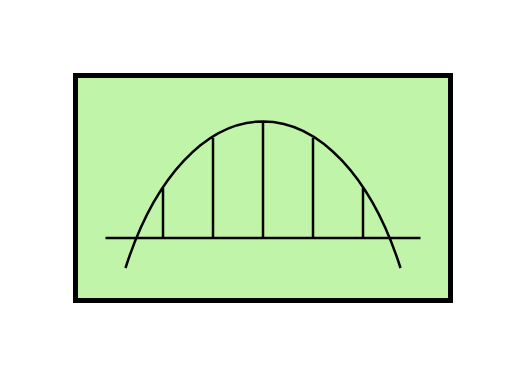

# Eip Messaging Channels Entities

- [ChannelAdapter](./channel-adapter.md)  

- [DatatypeChannel](./datatype-channel.md)  

- [DeadLetterChannel](./dead-letter-channel.md)  

- [InvalidMessageChannel](./invalid-message-channel.md)  

- [MessageBus](./message-bus.md)  

- [MessageBus2](./message-bus-2.md)  

- [MessageChannel](./message-channel.md)  

- [MessagingBridge](./messaging-bridge.md)  

- [PublishSubscribeChannel](./publish-subscribe-channel.md)  

- [PublishSubscribeChannel2](./publish-subscribe-channel-2.md)  

- [PublishSubscribeChannel3](./publish-subscribe-channel-3.md)  

