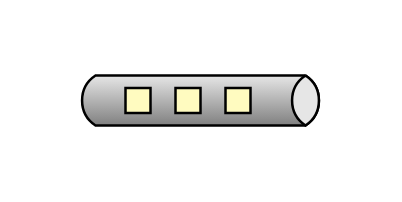

# Datatype Channel

## Definition

```js
{
  _style: {
    entity: 'strokeWidth=1;outlineConnect=0;dashed=0;align=center;html=1;fontSize=8;shape=mxgraph.eip.dataChannel;verticalLabelPosition=bottom;labelBackgroundColor=#ffffff;verticalAlign=top;',
  },
  _width: 100,
  _height: 20,
}
```

## Usage

```js
import { DatatypeChannel } from '@dinghy/standard-components-diagrams/eipMessagingChannels'

<DatatypeChannel/>
```

## Preview


