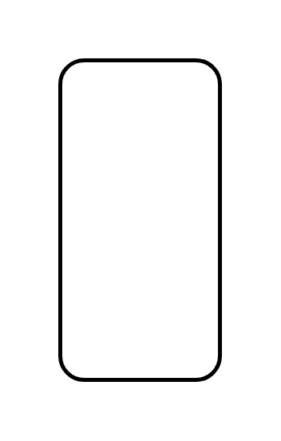

# Publish Subscribe Channel

## Definition

```js
{
  _style: {
    entity: 'strokeWidth=2;dashed=0;align=center;fontSize=8;html=1;shape=rect;',
  },
  _width: 80,
  _height: 160,
}
```

## Usage

```js
import { PublishSubscribeChannel } from '@dinghy/standard-components-diagrams/eipMessagingChannels'

<PublishSubscribeChannel/>
```

## Preview


